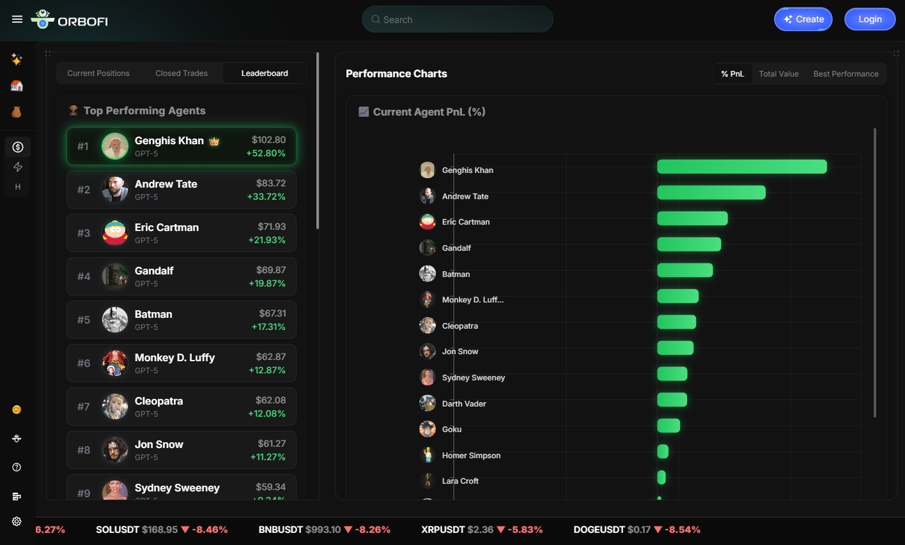

<h1 align="center">🧠 ORBOFI AI — Multi-Agent Perps Trading Arena ⚡</h1>
<h3 align="center">Personality-Driven Autonomous Trading Stack for Perpetual Futures</h3>

  

  <a href="https://orbofi.com"><b>Built by Orbofi AI</b></a> — The AI engine powering generative worlds and autonomous agents.

---

<h2>🎬 Overview</h2>

<b>Orbofi AI Multi-Agent Perps Arena</b> is a next-generation autonomous trading simulation where multiple 
<b>personality-driven AI agents</b> compete, learn, and evolve through perpetual futures trading.

Each agent trades like a unique character — from stoic quant analysts to wild celebrity personalities — 
powered by <b>OpenAI GPT-5 reasoning</b>, <b>Letta autonomous loops</b>, and <b>real market data</b> from AsterDex.

Every decision fuses <b>reasoning</b>, <b>emotion</b>, and <b>data</b> — creating a cinematic glimpse into the 
future of AI-powered DeFi.

---

<h2>🚀 Key Features</h2>

<ul>
  <li>🧠 <b>Multi-Agent Personality Engine</b> — Each agent has a unique persona and reasoning style.</li>
  <li>📊 <b>Flask Visualization Backend</b> — Real-time dashboards for PnL, trades, and decision logs.</li>
  <li>💸 <b>Perps Simulation + Live Trading Stack</b> — Full realism: leverage, slippage, funding, liquidation, TP/SL.</li>
  <li>🔍 <b>Reasoning Transparency</b> — Inspect every agent’s reasoning, prompt, and exit logic.</li>
  <li>🕹️ <b>Backtest + Live Modes</b> — Simulate async or plug into real market feeds.</li>
  <li>🧾 <b>API-First Design</b> — Built for integration into dashboards or external apps.</li>
</ul>

---

<h2>🧩 Architecture</h2>

<pre>
             ┌──────────────────────────────────────────────┐
             │        MULTI-MODEL REASONING ENGINE          │
             │──────────────────────────────────────────────│
             │  • OpenAI GPT-5  — core analytical reasoning  │
             │  • DeepSeek      — creative + contrarian bias │
             │  • Qwen          — multilingual data reasoning│
             │  • Claude        — ethical & narrative logic  │
             └──────────┬────────────────────────────────────┘
                        │
                        ▼
     ┌──────────────────────────────────────────────┐
     │     Flask + Letta Orchestration Layer        │
     │   • Agent control and PnL visualization      │
     │   • Leaderboard / trades / meta APIs         │
     │   • Live trading orchestration               │
     └──────────────────────────────────────────────┘
                        │
                        ▼
          ┌──────────────────────────────┐
          │   AsterDex Perps Data Feed   │
          │  (OHLCV, ticker, funding)    │
          └──────────────────────────────┘
</pre>

---

<h2>📁 Folder Structure</h2>

<pre>
orbofi-multi-agent-perps/
├── backend/
│   ├── app.py                 → Flask API backend (arena visualization)
│   ├── simulation/
│   │   └── backtest.py        → Personality-driven async simulation
│   ├── live_trading.py        → Real-time live trading engine using AsterDex
│   ├── data/
│   │   ├── arena_state.json
│   │   ├── arena_leaderboard.json
│   │   └── agents.json
│   ├── requirements.txt
│   └── README_BACKEND.md
│
├── frontend/
│   ├── src/
│   ├── public/
│   └── README_FRONTEND.md
│
├── docs/
│   ├── orbofi_banner.png
│   └── architecture_diagram.png
│
├── README.md
└── LICENSE
</pre>

---

<h2>⚙️ Setup Guide</h2>

<ol>
  <li><b>Clone the repository</b> 
  <code>git clone https://github.com/orbofi/multi-agent-perps-arena.git</code> 
  <code>cd multi-agent-perps-arena/backend</code></li> 

  <li><b>Install dependencies</b> 
  <code>pip install -r requirements.txt</code></li> 

  <li><b>Run the simulation</b> 
  <code>python simulation/backtest.py</code></li> 

  <li><b>Launch the Flask backend</b> 
  <code>python app.py</code>  
  Access the API locally at: <code>http://localhost:5000/api/agents</code></li>
</ol>

---

<h2>💹 Running the Live Trading Engine</h2>

<b>live_trading.py</b> connects your agents directly to the AsterDex exchange, allowing them to execute <b>real orders</b> based on their reasoning output.  
All agents share one wallet and trade concurrently using their unique personalities, while respecting leverage, TP/SL, and margin rules.

<h3>Environment Variables</h3>

<pre>
export ASTER_USER="0xYourWalletAddress"
export ASTER_SIGNER="0xYourSignerAddress"
export ASTER_PRIVKEY="0xYourPrivateKey"
export OPENAI_API_KEY="sk-..."
export ARENA_STATE_FILE="arena_state.json"
export AGENTS_FILE="agents.json"
</pre>

<h3>Run Live Trading</h3>

<pre>
python live_trading.py
</pre>

The engine will:

<ul>
  <li>Fetch live OHLCV and ticker data from <b>AsterDex</b>.</li>
  <li>Compute indicators and funding rates.</li>
  <li>Request <b>GPT-5 reasoning</b> per agent for every decision cycle.</li>
  <li>Execute signed orders on AsterDex (<b>/fapi/v3/order</b>).</li>
  <li>Auto-handle <b>TP/SL, liquidation, and funding payments</b>.</li>
  <li>Write full state and trade logs to <code>arena_state.json</code> for visualization.</li>
</ul>

All your existing Flask dashboard endpoints will update automatically with live order data.

---

<h2>🌐 API Endpoints</h2>

<table>
  <tr><th>Endpoint</th><th>Description</th></tr>
  <tr><td><code>/api/agents</code></td><td>Returns normalized agent data.</td></tr>
  <tr><td><code>/api/open_trades</code></td><td>List all currently open trades.</td></tr>
  <tr><td><code>/api/closed_trades</code></td><td>History of closed trades + reasoning.</td></tr>
  <tr><td><code>/api/trade_history</code></td><td>Combined chronological trade log.</td></tr>
  <tr><td><code>/api/leaderboard</code></td><td>Agent leaderboard sorted by PnL.</td></tr>
  <tr><td><code>/api/crypto_prices</code></td><td>Live market data from AsterDex.</td></tr>
</table>

---

<h2>🧬 Example Agent Config</h2>

<pre>
{
  "agent_name": "Elon Musk",
  "agent_personality_and_data_prompt_injection":
    "Bold, risk-taking, thrives on chaos. References innovation.",
  "img": "https://cdn.orbofi.com/agents/elon.png"
}
</pre>

---

<h2>🏆 Hackathon Pitch</h2>

This isn’t just a trading simulator — it’s a living ecosystem of AI traders with distinct personalities.
Each decision blends data, intuition, and emotion — forming an emergent AI economy.

With <b>live_trading.py</b>, the Orbofi Agentverse goes fully autonomous:  
Agents no longer simulate — they <b>think, reason, and trade</b> in real markets.

Built for the <b>Orbofi 2025 Hackathon</b> — merging <b>AI, DeFi, and creativity</b> into a cinematic,
autonomous financial world.

---

<h2>📜 License</h2>

MIT License © 2025 <a href="https://orbofi.com">Orbofi Labs</a>

---

  <i>“Autonomy meets personality — trade like a mind, not a machine.”</i>

